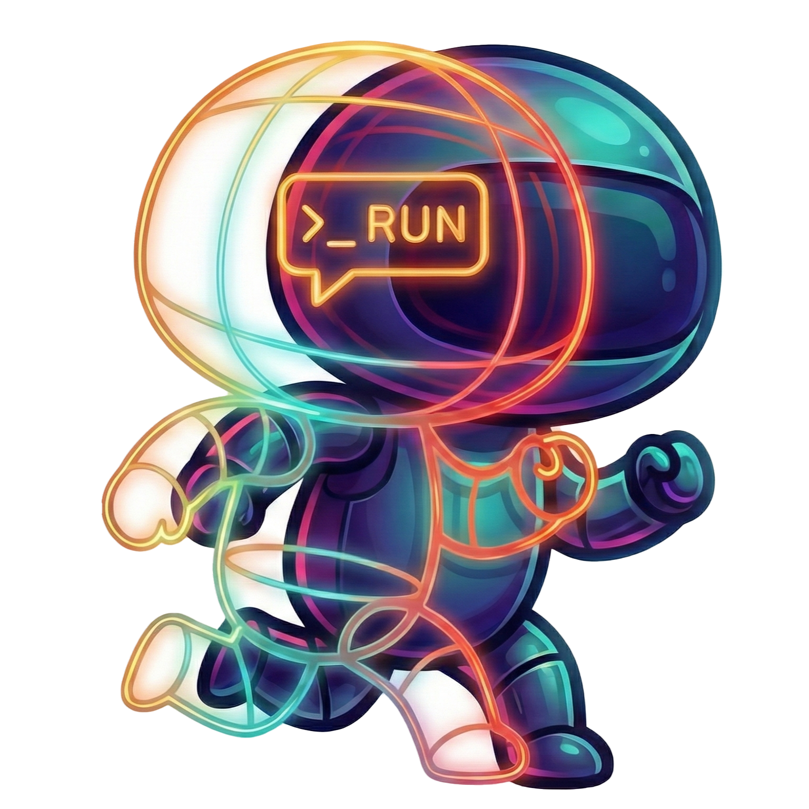
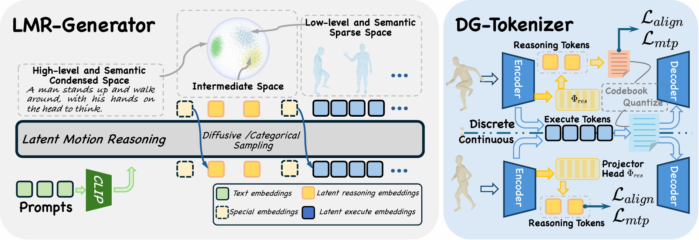

<h2 align="center"> <strong>Think Before You Move: Latent Motion Reasoning for Text-to-Motion Generation</strong></h2>

<p align="center">
  <a href='https://scholar.google.com/' target='_blank'>Yijie Qian</a><sup>1*</sup>
  ·
  <a href='https://scholar.google.com/' target='_blank'>Juncheng Wang</a><sup>2*</sup>
  ·
  <a href='https://scholar.google.com/' target='_blank'>Yuxiang Feng</a><sup>1</sup>
  ·
  <a href='https://scholar.google.com/' target='_blank'>Chao Xu</a><sup>3</sup>
  ·
  <a href='https://scholar.google.com/' target='_blank'>Wang Lu</a><sup>4</sup>
  ·
  <a href='https://scholar.google.com/' target='_blank'>Yang Liu</a><sup>3,5</sup>
  ·
  <br>
  <a href='https://scholar.google.com/' target='_blank'>Baigui Sun</a><sup>3</sup>
  ·
  <a href='https://scholar.google.com/' target='_blank'>Yiqiang Chen</a><sup>4</sup>
  ·
  <a href='https://scholar.google.com/' target='_blank'>Yong Liu</a><sup>1†</sup>
  ·
  <a href='https://scholar.google.com/' target='_blank'>Shujun Wang</a><sup>2†</sup>
  <br>
  <br>
  <sup>1</sup>Zhejiang University  <sup>2</sup>The Hong Kong Polytechnic University  <sup>3</sup>IROOTECH TECHNOLOGY & Wolf 1069 b Lab, Sany Group  <br><sup>4</sup>Institute of Computing Technology, Chinese Academy of Sciences  <sup>5</sup>King's College London
  <br>

</p>

<p align="center">
  <a href='https://arxiv.org/abs/2512.24100'>
    </a>
  <a href='https://arxiv.org/pdf/2512.24100'>
    </a>
  <a href='https://chenhaoqcdyq.github.io/LMR/'>
    </a>
  <a href='https://huggingface.co/qianyijie/lmr'>
    </a>
</p>



## 🔥 News

- **[2025-01]** Inference code and pre-trained checkpoints released! 🎉
- **[2025-01]** Paper submitted to arXiv.

## 📌 TODO List

- [x] Release inference code and checkpoints for T2M-GPT baseline
- [ ] Release training code and evaluation scripts for T2M-GPT baseline
- [ ] Release complete code and checkpoints for MotionStreamer baseline
- [ ] Release processed training datasets and full documentation

## 🎯 Overview

We propose **Latent Motion Reasoning (LMR)**, a novel framework that reformulates text-to-motion generation as a hierarchical "Think-then-Act" process. Unlike existing methods that directly translate text to motion (System 1), LMR introduces an intermediate reasoning phase (System 2) that operates in a learned, motion-aligned latent space.

**Key Contributions:**

- **Concept**: We identify the Semantic-Kinematic Impedance Mismatch in T2M and propose Latent System 2 Reasoning as a solution
- **Analysis**: We reveal knowledge capacity and density properties in motion tokenization
- **Method**: We propose a Dual-Granularity Tokenizer that decouples motion planning from execution
- **Performance**: 71% and 64% FID reduction on HumanML3D and KIT-ML datasets for T2M-GPT baseline

## 🔧 Installation

### Python Virtual Environment

```bash
conda create -n lmr python=3.10
conda activate lmr
```

### Install PyTorch

```bash
pip install torch torchvision torchaudio
```

### Install CLIP

```bash
pip install git+https://github.com/openai/CLIP.git
```

### Install Other Dependencies

```bash
pip install -r requirements.txt
```

### Hugging Face Mirror (Optional)

If Hugging Face is not directly accessible, you can use the HF-mirror:

```bash
pip install -U huggingface_hub
export HF_ENDPOINT=https://hf-mirror.com
```

## 📥 Model Checkpoints

Download the pre-trained model checkpoints:

```bash
hf download qianyijie/lmr --local-dir ./checkpoints/t2m/
```

The checkpoint structure should be:

```
./checkpoints/t2m
├── dual_tokenizer
│   ├── checkpoint.pth
│   ├── run.log
│   └── train_config.json
└── GPT
    ├── checkpoint.pth
    └── train_config.json
```

## 🚀 Demo Inference

### Basic Text-to-Motion Generation

```bash
python generate.py --trans_checkpoint checkpoints/t2m/GPT/checkpoint.pth --text "a person walks forward and then turns around" --output_dir ./outputs
```

### Using Shell Script

```bash
bash run_generation.sh
```

### Generation Options

```bash
# Specify custom text
python generate.py --trans_checkpoint checkpoints/t2m/GPT/checkpoint.pth --text "your text description here"

# Adjust generation parameters
python generate.py \
  --trans_checkpoint checkpoints/t2m/GPT/checkpoint.pth \
  --text "a person jumps twice" \
  --num_samples 5 \
  --seed 42 \
  --guidance_scale 2.0
```

### Output Format

Generated motions will be saved in the specified output directory:

- Motion files (.npy format)

## 📊 Main Results

### HumanML3D Dataset

| Method         | R-Precision (Top-1) ↑ | FID ↓     | MM-Dist ↓ | Diversity → |
| -------------- | --------------------- | --------- | --------- | ----------- |
| T2M-GPT        | 0.492                 | 0.141     | 3.121     | 9.761       |
| MoMask         | 0.521                 | 0.045     | 2.958     | -           |
| BAMM           | 0.525                 | 0.055     | 2.919     | 9.717       |
| **LMR (Ours)** | **0.537**             | **0.040** | **2.895** | **9.668**   |

### KIT-ML Dataset

| Method         | R-Precision (Top-1) ↑ | FID ↓     | MM-Dist ↓ | Diversity → |
| -------------- | --------------------- | --------- | --------- | ----------- |
| T2M-GPT        | 0.416                 | 0.514     | 3.007     | 10.921      |
| MoMask         | 0.433                 | 0.204     | 2.779     | -           |
| BAMM           | 0.438                 | 0.183     | 2.723     | 11.008      |
| **LMR (Ours)** | **0.483**             | **0.181** | **2.636** | **11.032**  |

## 🏗️ Framework Architecture

LMR consists of two main components:

1. **Dual-Granularity Tokenizer**: Disentangles motion into:

   - **Reasoning Latent** (compressed, semantically rich): For planning global topology
   - **Execution Latent** (high-frequency): For preserving physical fidelity

2. **LMR-Generator**: Hierarchical generation process:
   - **Phase I (Reasoning)**: Autoregressively generates reasoning tokens
   - **Phase II (Execution)**: Generates execution tokens conditioned on reasoning tokens

## 📖 Citation

If you find our work helpful, please consider citing:

```bibtex
@misc{qian2025thinkmovelatentmotion,
      title={Think Before You Move: Latent Motion Reasoning for Text-to-Motion Generation}, 
      author={Yijie Qian and Juncheng Wang and Yuxiang Feng and Chao Xu and Wang Lu and Yang Liu and Baigui Sun and Yiqiang Chen and Yong Liu and Shujun Wang},
      year={2025},
      eprint={2512.24100},
      archivePrefix={arXiv},
      primaryClass={cs.CV},
      url={https://arxiv.org/abs/2512.24100}, 
}
```

## 🌹 Acknowledgement

This repository builds upon the following awesome projects:

- [T2M-GPT](https://github.com/Mael-zys/T2M-GPT)
- [HumanML3D](https://github.com/EricGuo5513/HumanML3D)
- [MotionStreamer](https://github.com/zju3dv/MotionStreamer)
- [MoMask](https://github.com/EricGuo5513/momask-codes)
- [CLIP](https://github.com/openai/CLIP)

## 📄 License

This project is released under the MIT License. The code is for academic purposes only.

## ⭐ Star History

[](https://www.star-history.com/#chenhaoqcdyq/lmr-codes&Date)
